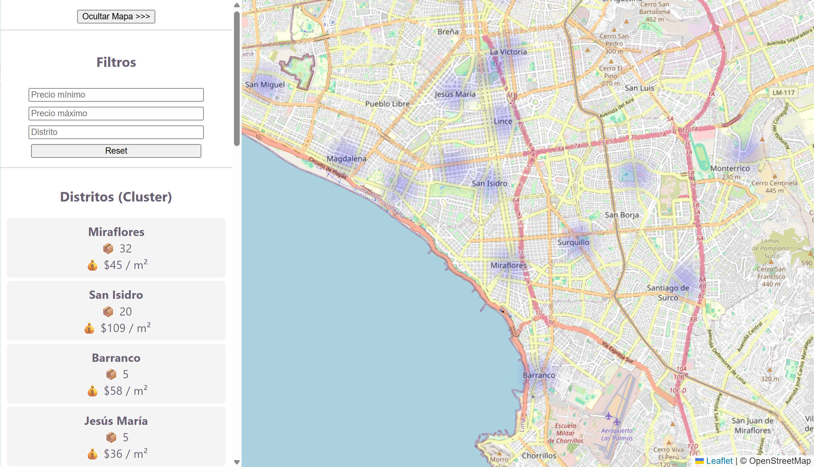
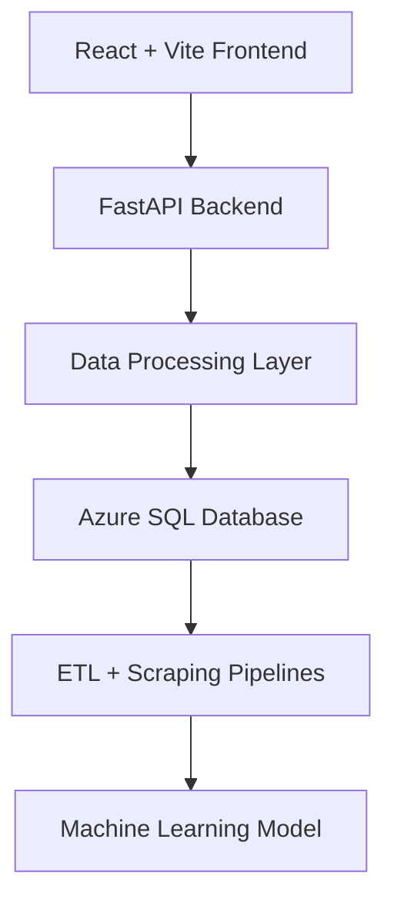
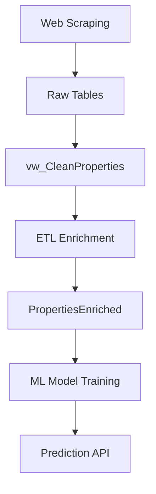

# 🔮 Nostradatus AI Web

## 🚀 Overview

**Nostradatus AI Web** is an AI-powered real estate intelligence platform that enables users to analyze property markets through **geospatial visualization, clustering, and machine learning predictions**.

Instead of static listings, the platform provides an **interactive, data-driven experience** where users can explore property trends, detect high-value zones, and understand pricing dynamics in real time.

> ⚡ **End-to-End Data Pipeline**
> Powered by **web scraping, ETL processing, and ML models**, transforming raw data into actionable insights.

---

## 📸 Demo



> 💡 Interactive heatmaps, district clustering, and real-time property exploration.

---

## 🗺️ Geospatial Intelligence Interface

### 🔥 Heatmap Visualization

* Dynamic heatmap based on **price per m²**
* Identifies high-demand zones instantly
* Weighted intensity using real market data

---

### 📊 District Clustering

* Aggregation of properties by district
* Displays:

  * 📦 Total properties
  * 💰 Average price per m²
* Clickable clusters for quick filtering

> ⚡ Enables fast macro-level market understanding

---

### 🏠 Property Exploration

* Interactive property list
* Real-time filtering
* Click-to-focus on map

Each property includes:

* Title
* Price
* District
* Exact geolocation

---

### 🎯 Smart Filtering System

Users can refine data dynamically:

* Minimum price
* Maximum price
* District name

> 🔄 Filters trigger real-time updates across:
>
> * Heatmap
> * Clusters
> * Property list

---

### 📍 Map Interaction

* Built with **Leaflet**
* Smooth zoom and pan
* Property highlighting on selection
* Real-time synchronization with sidebar

---

## 🏗️ System Architecture

### High-Level Architecture



---

### 🔬 Data Pipeline



---

## ⚙️ How It Works

The system processes real estate data through a structured pipeline:

* **Web Scraping** → Collects raw property data
* **Data Cleaning View** → Normalizes and filters
* **ETL Process** → Enriches and structures data
* **Clustering Logic** → Aggregates by district
* **Heatmap Generation** → Computes spatial density
* **ML Model** → Predicts property values
* **API Layer** → Serves data to frontend

---

## ✨ Key Features

* 🗺️ Geospatial heatmap visualization
* 📊 District-level clustering
* 🏠 Interactive property exploration
* 🎯 Real-time filtering
* 🤖 ML-based price prediction
* ⚡ Live API integration
* 📱 Responsive UI
* 🧩 Modular architecture
* ☁️ Cloud deployment (Azure)

---

## 🛠️ Technology Stack

### Frontend

* React
* Vite
* React Leaflet

### Backend

* FastAPI
* Python
* Uvicorn

### Data Layer

* SQL Server / Azure SQL
* ETL Pipelines
* Web Scraping

### AI & Processing

* Scikit-learn
* Pandas
* Joblib

### Cloud

* Azure App Service
* Azure SQL Database

---

## ▶️ Getting Started

### Prerequisites

* Node.js
* Python 3.10+
* SQL Server / Azure SQL

---

### Run Backend

```bash
uvicorn main:app --reload
```

---

### Run Frontend

```bash
npm install
npm run dev
```

---

## ⚙️ Environment Configuration

Create `.env` file:

```env
VITE_API_URL=http://localhost:8000
```

---

## 📁 Project Structure

```
/nostradatusaiweb.client   → React + Vite frontend
/nostradatusai.api         → FastAPI backend
/nostradatusai.etl         → Data processing
/nostradatusai.ingestion   → Web scraping
/nostradatusai.ml          → Machine learning
```

---

## 🧠 Architecture Decisions & Trade-offs

### 1️⃣ Geospatial Visualization First

**Why:**

* Intuitive understanding of market dynamics

**Trade-off:**

* Requires coordinate cleaning and validation

---

### 2️⃣ ETL + Clean View Layer

**Why:**

* Ensures consistent and reliable data

**Trade-off:**

* Additional processing time

---

### 3️⃣ Heatmap over Raw Points

**Why:**

* Better pattern recognition

**Trade-off:**

* Loss of individual detail at macro level

---

### 4️⃣ Client-Side Filtering + API Filtering

**Why:**

* Performance + flexibility

**Trade-off:**

* More complex state management

---

### 5️⃣ ML Model Integration

**Why:**

* Adds predictive capability

**Trade-off:**

* Model maintenance and retraining needed

---

## 📊 Future Improvements

* AI-driven investment recommendations
* Advanced clustering (K-Means / DBSCAN)
* Time-series price evolution
* User accounts & saved searches
* Alert system for opportunities
* Interactive analytics dashboard

---

## 🤝 Contribution

Contributions are welcome. Fork the repo and submit a PR.

---

## 📄 License

MIT License

---

## 👨‍💻 Author

Cesar Rosales

---

## ⭐ Final Note

This project demonstrates how **AI + Data Engineering + Geospatial Visualization** can transform real estate analysis into an **interactive, intelligent, and actionable experience**.

> From raw property data → to spatial insights → to predictive intelligence.
